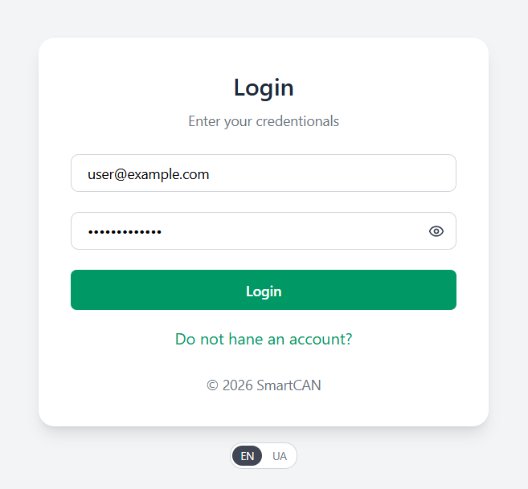
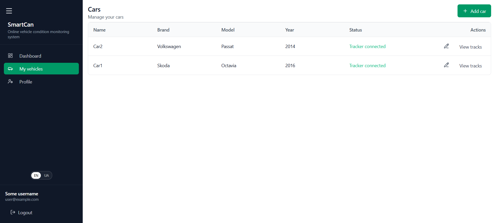
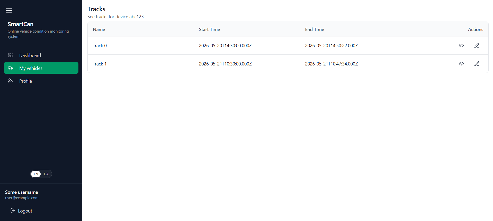
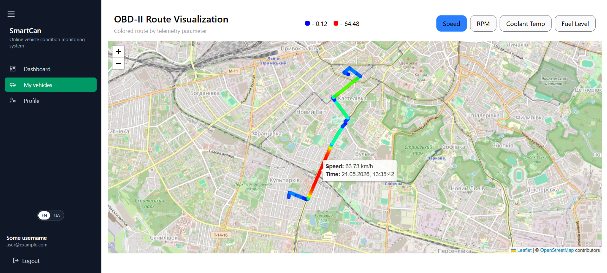

[](https://vite.dev/)
[](https://www.typescriptlang.org/)
[](https://tailwindcss.com/)
[](https://reactrouter.com/7.18.2/home)
[](https://leafletjs.com/)
[](https://tanstack.com/query/latest)
[](https://zod.dev/)

# OBD-II Vehicle Tracker Frontend

React frontend for the SmartCAN OBD-II Vehicle Tracker.

## Features

- JWT authentication
- Vehicle management
- Vehicle telemetry
- Trip history
- Interactive map
- Responsive UI
- Internationalization

## Tech Stack
 - React
 - TypeScript
 - Vite
 - Tailwind CSS
 - React Query
 - React Router
 - Axios
 - Leaflet
 - React Hook Form
 - Zod

## Project Structure
```text
public/
└── locales/
    ├── en/
    └── uk/
scripts/
└── generate-i18n-types.ts
src/
├── app/
│   └── QueryProvider.tsx
├── components/
│   └── ui/
├── context/
├── features/
│   ├── common/
│   ├── auth/
│   ├── device/
│   ├── telemetry/
│   ├── track/
│   ├── users/
│   └── vehicles/
├── hooks/
├── i18n/
├── layouts/
├── pages/
│   ├── auth/
│   ├── device/
│   ├── home/
│   ├── track/
│   └── vehicles/
├── routes/
│   ├── loaders/
│   └── AppRoute.tsx
├── services/
│   └── api.ts
│
├── App.tsx
└── main.tsx
```


# Running

```bash
git clone https://github.com/pavlo606/smart-can-frontend.git
cd smart-can-frontend

npm install
npm run i18n:types
npm run dev
```

# Environment Variables

One `.env` file with backend url.

```bash
VITE_API_URL="http://localhost:3000"
```

# Screenshots

### Login form


### Vehicle list


### Track list


### Interractive map


# Backend

Backend repository

> https://github.com/pavlo606/smart-can-backend

# Demo

Live demo:

> https://smart-can-frontend-production.up.railway.app/

Swagger documentation for API:

> https://smart-can-backend-production.up.railway.app/api/docs

# License

This project was developed as a Bachelor's degree project.